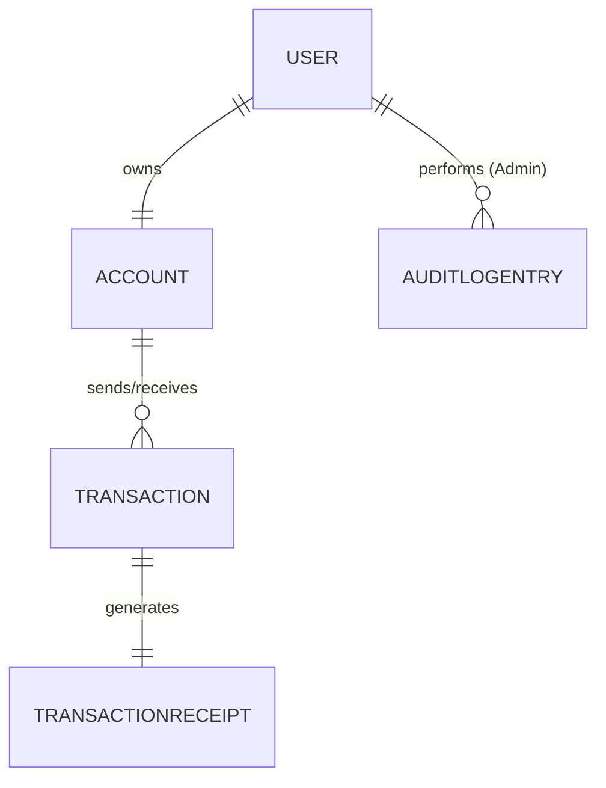
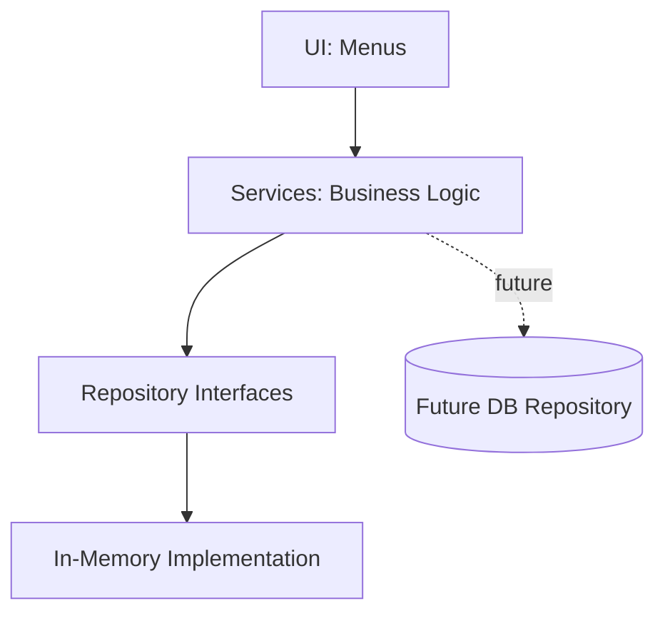

	  
# 📱 BkashConsoleClone — Complete Project & Learning Reference

> একটি bKash-inspired Educational Console Simulation — C# শেখার জন্য, Project বানাতে বানাতে।

> ⚠️ **Disclaimer:** এই Project সম্পূর্ণ শিক্ষামূলক Simulation। কোনো Real bKash Account, 
> Real Money, Payment Gateway বা Real Financial Transaction ব্যবহার হয় না। bKash-এর 
> সঙ্গে এই Project-এর কোনো সম্পর্ক নেই।

| বিষয় | মান |
|---|---|
| Project Name | `BkashConsoleClone` |
| Language / Platform | C# / .NET Console Application (Latest LTS) |    ||
| Storage | শুধু In-memory |
| Testing | xUnit (Phase 4 থেকে) |
| Version Control | Git + GitHub |
| Learning Style | নিজে লেখা → Review → Refactor |
| Status | 📝 Planning Complete — Phase 0 শুরুর অপেক্ষায় |

> 🔗 **Linking Convention:** নিচের প্রতিটি Feature Table-এর "C# Topic" Column-এ যে নামগুলো 
> আছে, সেগুলো **Section 24: Topic Glossary**-তে ঠিক একই নামে (বা কাছাকাছি নামে) Anchor 
> আকারে ব্যাখ্যা করা আছে। Markdown Viewer-এ (GitHub/VS Code Preview) প্রতিটা Topic নাম থেকে 
> `[TopicName](#topic-topicname)` আকারে Link বসালে ক্লিক করে সরাসরি ব্যাখ্যায় যাওয়া যাবে। 
> (Section 24-এর শুরুতে পুরো Index দেওয়া আছে, Ctrl+F দিয়েও খোঁজা যাবে।)

---

## 📑 সূচিপত্র

1. [Project Overview](#1-project-overview)
2. [Complete Feature List](#2-complete-feature-list)
3. [Feature Tiers](#3-feature-tiers-mvp-core-advanced-optional)
4. [Functional Requirements](#4-functional-requirements)
5. [Non-Functional Requirements](#5-non-functional-requirements)
6. [Complete Folder Structure](#6-complete-folder-structure)
7. [প্রতিটি File-এর Responsibility](#7-প্রতিটি-file-এর-responsibility)
8. [Data Models](#8-data-models)
9. [In-memory Data Storage Design](#9-in-memory-data-storage-design)
10. [Data Relationships](#10-data-relationships)
11. [Architecture Diagram](#11-architecture)
12. [Transaction Data Flow](#12-transaction-data-flow)
13. [Business Rules](#13-business-rules)
14. [Error Handling Strategy](#14-error-handling-strategy)
15. [Security Considerations](#15-security-considerations)
16. [Testing Strategy](#16-testing-strategy)
17. [Development Roadmap](#17-development-roadmap)
18. [Known Limitations](#18-known-limitations)
19. [Future Extension Plan](#19-future-extension-plan)
20. **[Section 24: Complete Topic Glossary](#24-complete-topic-glossary)** ⭐ (মূল Learning Reference)

---

# 1. Project Overview

## 1.1 Project কী?

`BkashConsoleClone` একটি Console-based Mobile Financial Service (MFS) **Simulation**। User Registration → Login → Balance Check → Cash In/Cash Out/Send Money/Recharge → Transaction History/Receipt। Admin User List/Search, Account Activate-Deactivate, Report/Statistics দেখতে পারবে।

**মূল কথা:** Application লক্ষ্য নয়, শেখার মাধ্যম।

## 1.2 কোন সমস্যার Simulation করে?

| বাস্তব সমস্যা | এই Project-এ Simulation |
|---|---|
| একজনের Balance থেকে আরেকজনের Balance-এ যাওয়া | Debit+Credit একসঙ্গে সফল, নয়তো কোনোটিই না |
| ভুল Input আটকানো | Input + Business Rule Validation |
| একই Request দুইবার চললে দুইবার কাটা | Idempotency Key দিয়ে Duplicate Prevention |
| টাকার Precision ভুল | `decimal` ব্যবহার ও Rounding Rule |
| কে কী করেছে তার প্রমাণ | Transaction History + Audit Log |
| ভুল PIN বারবার | Attempt Counter + Lock |
| User/Admin আলাদা ক্ষমতা | Role-based Authorization |
| Fee/Limit বদলানো | Configuration-driven Policy |

## 1.3 কেন এই Project?

Tutorial Syntax মুখস্থ করা আর আসল Software বানানো ভিন্ন জিনিস। Financial Domain-এ Correctness জরুরি বলে Design ভুল হলে সহজেই ধরা পড়ে — শেখার জন্য আদর্শ। একই Project-এ Variable থেকে async/await, Testing পর্যন্ত স্বাভাবিকভাবে ব্যবহার হয়।

## 1.4 Scope

### ✅ In Scope
User Management, Account Management, Transaction Management, Admin Features, System Features (Menu, Validation, Exception Handling, Logging, Config, Testing), In-memory Storage + Optional JSON Export/Import।

### ❌ Out of Scope
Database (SQL/NoSQL/EF Core), Real Payment Gateway/Bank/SMS/OTP, Web/Mobile UI/REST API, Real KYC/AML/Compliance, Distributed System/Microservices, Multi-user Concurrent Access।

## 1.5 Simulation বনাম বাস্তব System

| দিক | Simulation | বাস্তব System |
|---|---|---|
| Data | Memory, App বন্ধ হলে হারায় | Durable DB, Backup, Replication |
| Atomicity | Validate-first কৌশল | ACID Transaction / Saga |
| Ledger | সরল Balance + List | Double-entry Ledger |
| Auth | PIN + Hash + Lockout | MFA/OTP, HSM |
| Compliance | নেই | KYC/AML, Regulation |
| Concurrency | Single-threaded | High-concurrency |

## 1.6 অর্জিত Skill

C# Foundation, OOP, Layered Architecture, SOLID, Data Integrity (`decimal`, Atomicity, Idempotency), Unit Testing, Security Basics, Git Workflow, Requirement→Design→Implement→Test→Review চক্র।

## 1.7 Technology

.NET SDK (Latest LTS), VS Code/Visual Studio, xUnit, Git+GitHub, `dotnet format`, `System.Text.Json`। শুরু থেকেই `<Nullable>enable</Nullable>`।

---

# 2. Complete Feature List

> প্রতিটি Feature: Purpose → User Action → Business Rules (BR-xx, [Section 13](#13-business-rules)) → Responsible Class → **C# Topic** ([Glossary](#24-complete-topic-glossary)-এ Linked) → Acceptance Criteria।

## 2.1 User Management

**F-01 · User Registration — `MVP`**
Purpose: নতুন User + Auto Account তৈরি। Rules: BR-01..04. Class: `UserService`, `InputValidator`, `Pbkdf2PinHasher`, `IUserRepository`.
**Topics:** [Variables](#topic-variables), [Conditions](#topic-conditions), [String Methods](#topic-string-methods), [TryParse](#topic-tryparse), [Class & Constructor](#topic-class-constructor), [Dictionary](#topic-collections).
Acceptance: বৈধ তথ্যে Success, Balance ৳0 · Duplicate Mobile Reject · দুর্বল PIN Reject · PIN কখনো Plain-text নয়।

**F-02 · Login/Logout — `MVP`**
Rules: BR-05,06,21. Class: `AuthService`, `SessionManager`, `Pbkdf2PinHasher`.
**Topics:** [Methods](#topic-methods), [Loops](#topic-loops), [Custom Exception](#topic-custom-exception), [Encapsulation](#topic-encapsulation), [readonly/const](#topic-readonly-const).
Acceptance: সঠিক Credential Login · ভুলে Generic বার্তা · ৩ বার ভুলে Lock · Logout-এ Session খালি।

**F-03 · User Profile — `Core`**
Class: `UserService`, `StringExtensions.MaskMobile`.
**Topics:** [Properties](#topic-encapsulation), [ToString/Equals/GetHashCode](#topic-object-methods), [Extension Methods](#topic-extension-methods).
Acceptance: PIN/Hash অদৃশ্য · Mobile Masked।

**F-04 · Account Status — `MVP`**
Class: `Account`, `AccountStatus` enum.
**Topics:** [Enum](#topic-enum), [Switch/Pattern Matching](#topic-pattern-matching).
Acceptance: নতুন Account Active · Status Transaction-এ প্রভাব ফেলে।

**F-05 · Account Number — `MVP`**
**Topics:** [String Methods](#topic-string-methods), [Dictionary Key](#topic-collections), [Immutability (init/readonly)](#topic-readonly-const).
Acceptance: ভুল Format Reject · Account Number পরে বদলায় না।

**F-06 · PIN Change — `Core`**
**Topics:** [Methods](#topic-methods), [Hashing](#topic-hashing), [byte\[\]/Convert], [Defensive Programming](#topic-guard-clause).
Acceptance: ভুল পুরোনো PIN ব্যর্থ · নতুন=পুরোনো ব্যর্থ · নতুন Hash+Salt সংরক্ষিত।

**F-07 · Session Management — `Core`**
**Topics:** [Class State], [DateTime/TimeSpan](#topic-datetime), [Interface IClock](#topic-interface), [Nullable Reference Types](#topic-nullable).
Acceptance: Login ছাড়া Menu বন্ধ · Timeout-এ পুনরায় Login লাগে।

## 2.2 Account Management

**F-08 · Account Creation — `MVP`**
**Topics:** [Constructor](#topic-class-constructor), [Constructor Overloading](#topic-class-constructor), [this](#topic-this), [Object Initializer](#topic-class-constructor).
Acceptance: প্রতি User-এর ঠিক ১টা Account · Balance ৳0।

**F-09 · Balance Check — `MVP`**
**Topics:** [decimal](#topic-decimal), [Format String](#topic-string-methods), [Extension Method](#topic-extension-methods).
Acceptance: ২ দশমিক ঘর সঠিক · ভুল PIN-এ দেখায় না।

**F-10 · Account Information — `Core`**
**Topics:** [LINQ (Where/Sum)](#topic-linq-basics), [DateTime.Date](#topic-datetime), [Composition](#topic-composition).
Acceptance: আজকের ব্যবহৃত Limit সঠিক।

**F-11 · Account Status Validation — `MVP`**
**Topics:** [Custom Exception](#topic-custom-exception), [Guard Clause](#topic-guard-clause), [throw](#topic-custom-exception).
Acceptance: Suspended Sender/Receiver উভয়ে ব্যর্থ, Balance অপরিবর্তিত।

**F-12 · Balance Integrity Rules — `MVP`**
**Topics:** [Encapsulation (private set)](#topic-encapsulation), [Defensive Programming](#topic-guard-clause), [decimal](#topic-decimal), [Invariant].
Acceptance: Balance Negative হওয়ার পথ নেই (Test প্রমাণিত)।

## 2.3 Transaction Management

**F-13 · Cash In — `MVP`** | **F-14 · Cash Out — `MVP`** | **F-15 · Send Money — `MVP`**
**Topics:** [Methods](#topic-methods), [decimal](#topic-decimal), [Math.Round](#topic-rounding), [Fee Calculation], [Atomic Update Design], [Custom Exception](#topic-custom-exception).
Acceptance: Balance ঠিক বাড়ে/কমে · Limit অতিক্রমে ব্যর্থ · নিজের কাছে Send বাতিল · ব্যর্থতায় Balance অপরিবর্তিত।

**F-16 · Mobile Recharge — `Core`**
**Topics:** [Dictionary/HashSet](#topic-collections), [Pattern Matching](#topic-pattern-matching), [async/await](#topic-async) (Fake Delay).
Acceptance: অজানা Prefix/সীমার বাইরে Amount Reject।

**F-17 · Transaction History — `MVP`**
**Topics:** [List\<T\>](#topic-collections), [foreach](#topic-loops), [LINQ](#topic-linq-basics), [IReadOnlyList], [yield/Iterator](#topic-yield).
Acceptance: শুধু নিজের Transaction, নতুন আগে।

**F-18 · Transaction Details — `Core`**
**Topics:** [Dictionary Lookup](#topic-collections), [TryGetValue](#topic-collections), [Nullable Return](#topic-nullable).
Acceptance: অন্যের ID-তে তথ্য ফাঁস হয় না।

**F-19 · Transaction Receipt — `Core`**
**Topics:** [record](#topic-record), [StringBuilder](#topic-stringbuilder), [Immutability](#topic-record).
Acceptance: Failed-এর Receipt হয় না।

**F-20 · Transaction Status — `MVP`**
**Topics:** [Enum](#topic-enum), [State Transition], [Encapsulation](#topic-encapsulation).
Acceptance: Completed Edit হয় না · Failed-এ Reason থাকে।

**F-21 · Transaction ID Generation — `MVP`**
**Topics:** [Static Members](#topic-static), [Guid](#topic-static), [Interface for Testability](#topic-interface), [Interlocked](#topic-thread-safety).
Acceptance: ১০,০০০ বারে Duplicate নেই।

**F-22 · Filtering/Sorting — `Core`**
**Topics:** [LINQ](#topic-linq-basics), [Lambda](#topic-lambda), [Func\<T,bool\>](#topic-lambda), [Deferred Execution](#topic-linq-advanced), [struct/record struct](#topic-struct).
Acceptance: Multi-filter সঠিক ফল।

**F-23 · Transaction Validation — `MVP`**
**Topics:** [Guard Clauses](#topic-guard-clause), [Custom Exception](#topic-custom-exception), [Pattern Matching](#topic-pattern-matching), [SRP].
Acceptance: প্রতি Rule-এ Pass+Fail Test।

**F-24 · Transaction Failure Handling — `MVP`**
**Topics:** [try/catch/finally](#topic-custom-exception), [Exception Filters (when)](#topic-custom-exception), [Rollback কৌশল].
Acceptance: কৃত্রিম ব্যর্থতাতেও Balance অপরিবর্তিত।

**F-25 · Duplicate Prevention — `Advanced`**
**Topics:** [Dictionary/HashSet](#topic-collections), [Composite Key], [Idempotency].
Acceptance: দ্বিতীয় Request একই Result ফেরত দেয়, Balance একবার বদলায়।

**F-26 · Limits/Fee — `Core`**
**Topics:** [decimal](#topic-decimal), [Switch Expression](#topic-pattern-matching), [record](#topic-record), [Strategy](#topic-strategy).
Acceptance: Boundary Test Pass।

**F-27 · Balance Update Rules — `MVP`**
**Topics:** [Encapsulation](#topic-encapsulation), [Invariant], [Reference Type](#topic-copy), [Shallow/Deep Copy](#topic-copy).
Acceptance: মোট Debit = মোট Credit+Fee।

## 2.4 Admin Features

**F-28 · Admin Login — `Core`**
**Topics:** [Enum](#topic-enum), [Authorization](#topic-authz), [Secrets Management].

**F-29..31 · User List/Search/Details — `Core`**
**Topics:** [LINQ OrderBy/Skip/Take](#topic-linq-basics), [string.Contains/StringComparison](#topic-string-methods), [DTO](#topic-dto), [record](#topic-record).

**F-32 · Activate/Deactivate — `Core`**
**Topics:** [State Change], [Authorization](#topic-authz), [Event](#topic-events).

**F-33 · Transaction Search — `Advanced`**
**Topics:** [LINQ Composition](#topic-linq-advanced), [IQueryable ধারণা], [Deferred Execution](#topic-linq-advanced).

**F-34 · Transaction Report — `Advanced`**
**Topics:** [LINQ GroupBy](#topic-linq-advanced), [StringBuilder](#topic-stringbuilder), [async](#topic-async).

**F-35 · Summary Statistics — `Advanced`**
**Topics:** [LINQ Aggregation (Sum/Avg/Count/Max)](#topic-linq-basics), [decimal Division সতর্কতা](#topic-decimal).

**F-36 · Audit Logging — `Core`**
**Topics:** [Event Subscription](#topic-events), [Append-only Design], [IReadOnlyList].

## 2.5 System Features

**F-37 · Menus — `MVP`**
**Topics:** [Loops](#topic-loops), [Switch](#topic-conditions), [Partial Class](#topic-partial-class), [Static Helper](#topic-static).

**F-38 · Input Validation — `MVP`**
**Topics:** [TryParse/out](#topic-tryparse), [string.IsNullOrWhiteSpace](#topic-string-methods), [Static Class](#topic-static).

**F-39 · Exception Handling — `MVP`**
**Topics:** [try/catch/finally](#topic-custom-exception), [Custom Exception Hierarchy](#topic-custom-exception), [throw vs throw ex](#topic-custom-exception).

**F-40 · Logging — `Core`**
**Topics:** [Interface](#topic-interface), [IDisposable/using](#topic-idisposable), [File I/O], [params](#topic-params-ref-out).

**F-41 · Configuration — `Core`**
**Topics:** [const vs readonly](#topic-readonly-const), [record](#topic-record), [Immutability](#topic-record).

**F-42 · In-memory Data Management — `MVP`**
**Topics:** [List/Dictionary/HashSet](#topic-collections), [Generics](#topic-generics), [IReadOnlyList], [Encapsulation](#topic-encapsulation).

**F-43 · JSON Export/Import — `Optional`**
**Topics:** [System.Text.Json](#topic-serialization), [Serialization/Deserialization](#topic-serialization), [async File I/O](#topic-async), [IDisposable/using](#topic-idisposable).

**F-44 · Unit Testing — `Core`**
**Topics:** [xUnit/AAA Pattern](#topic-unit-testing), [Theory/InlineData](#topic-unit-testing), [Fakes/Mocking](#topic-unit-testing), [Boundary Testing](#topic-unit-testing).

**F-45 · Debugging — `Core`**
**Topics:** [Breakpoint/Watch/Call Stack], [Debug.Assert], [Conditional attribute].

---

# 3. Feature Tiers: MVP, Core, Advanced, Optional

| Tier | Features | লক্ষ্য |
|---|---|---|
| **MVP** | F-01,02,04,05,08,09,11,12,13,14,15,17,20,21,23,24,27,37,38,39,42 | Register→Login→CashIn→SendMoney→History, Balance অক্ষুণ্ণ |
| **Core** | F-03,06,07,10,16,18,19,22,26,28,29,30,31,32,36,40,41,44,45 | সম্পূর্ণ User/Admin অভিজ্ঞতা |
| **Advanced** | F-25,33,34,35 | Idempotency, Search, Report, Statistics |
| **Optional** | F-43 + DI Container, appsettings.json, Reversal, CSV Export, CI, Multi-language | Extension |

> প্রতিটি Tier শেষে Git Tag: `v0.1.0-mvp`, `v0.2.0-core`, ইত্যাদি।

---

# 4. Functional Requirements

| ID | Requirement | Feature | Tier |
|---|---|---|---|
| FR-01 | নাম/মোবাইল/PIN দিয়ে Registration | F-01 | MVP |
| FR-02 | Registration-এ ৳0 Balance Account | F-08 | MVP |
| FR-03 | Unique, বৈধ মোবাইল বাধ্যতামূলক | F-05 | MVP |
| FR-04 | PIN Salt+Hash, কখনো Plain-text নয় | F-01,06 | MVP |
| FR-05 | সঠিক Credential-এ Login+Session | F-02 | MVP |
| FR-06 | N বার ভুলে Lock | F-02 | MVP |
| FR-07 | Logout/Timeout-এ Session ক্লিয়ার | F-02,07 | Core |
| FR-08 | Profile/Account Info (Sensitive ছাড়া) | F-03,10 | Core |
| FR-09 | PIN পরিবর্তন (পুরোনো যাচাই-সহ) | F-06 | Core |
| FR-10 | PIN যাচাইয়ের পর Balance | F-09 | MVP |
| FR-11 | Cash In/Out, Send Money, Recharge | F-13..16 | MVP/Core |
| FR-12 | প্রতি Money-moving-এ PIN Confirm | F-13..16 | MVP |
| FR-13 | Fee+মোট কর্তন Confirm-এর আগে দেখানো | F-26 | Core |
| FR-14 | Inactive Account-এ Transaction Reject | F-11 | MVP |
| FR-15 | Insufficient/Invalid/Self-Send/Unknown Reject | F-15,23 | MVP |
| FR-16 | Per-transaction/Daily Limit | F-26 | Core |
| FR-17 | Debit+Credit Atomic | F-24,27 | MVP |
| FR-18 | প্রতি Attempt-এ Status-সহ Record | F-17,20 | MVP |
| FR-19 | Unique Transaction ID | F-21 | MVP |
| FR-20 | Success-এ Receipt | F-19 | Core |
| FR-21 | History+Filter+Sort | F-17,22 | MVP/Core |
| FR-22 | Idempotency Key Duplicate Block | F-25 | Advanced |
| FR-23 | Admin Role আলাদা যাচাই | F-28 | Core |
| FR-24 | Admin: User List/Search/Details | F-29..31 | Core |
| FR-25 | Admin: Activate/Deactivate+কারণ | F-32 | Core |
| FR-26 | Admin: Search/Report/Statistics | F-33..35 | Advanced |
| FR-27 | Admin Action Audit Log (Immutable) | F-36 | Core |
| FR-28 | সব Input Validate, Crash নয় | F-38 | MVP |
| FR-29 | Unexpected Exception → Friendly বার্তা+Log | F-39,40 | MVP/Core |
| FR-30 | Fee/Limit/Timeout Config থেকে | F-41 | Core |
| FR-31 | সব Data In-memory+Repository Abstraction | F-42 | MVP |
| FR-32 | (Optional) JSON Export/Import | F-43 | Optional |
| FR-33 | Business Logic Unit Test-যোগ্য | F-44 | Core |

---

# 5. Non-Functional Requirements

| # | Requirement | কেন | যাচাই পদ্ধতি |
|---|---|---|---|
| NFR-01 | Maintainability | ৬ মাস পরে বুঝতে পারা | Small Method, SRP, Code Review |
| NFR-02 | Readability | Code পড়া বেশি হয় লেখার চেয়ে | অর্থবহ নাম, `dotnet format`, 0 Warning |
| NFR-03 | Separation of Concerns | UI বদলে Logic না ভাঙা | Service-এ `Console.` নেই |
| NFR-04 | Testability | সস্তায় Bug ধরা | Interface Injection, Fake Clock/IdGenerator |
| NFR-05 | Reliability | টাকায় ভুল গ্রহণযোগ্য না | Atomic+Failure Injection Test |
| NFR-06 | Input Validation | Input অবিশ্বস্ত | Empty/Space/Negative/Huge Test তালিকা |
| NFR-07 | Error Handling | Crash নয় | Top-level Handler Test |
| NFR-08 | Data Integrity | Balance/History সঙ্গতি | Conservation Test |
| NFR-09 | Performance (মৌলিক) | অপ্রয়োজনীয় O(n) এড়ানো | Stopwatch benchmark |
| NFR-10 | Secure Coding | Financial Domain অভ্যাস | PIN Hash, Lockout, Masked Log |
| NFR-11 | Consistent Naming | অনুমানযোগ্যতা | `.editorconfig` |
| NFR-12 | Predictable Behaviour | একই Input=Output | `IClock` ব্যবহার, Global State নয় |
| NFR-13 | Extensibility | নতুন Type যোগ সহজ | Open/Closed যাচাই (Phase 6 Refactor) |
| NFR-14 | User-friendly Output | ব্যবহারযোগ্যতা | স্পষ্ট Prompt/Table/রঙ |
| NFR-15 | Documentation | শেখা ধরে রাখা | README, ADR, learning-log.md |

---

# 6. Complete Folder Structure

```text
BkashConsoleClone/
├── BkashConsoleClone.sln
├── README.md / .gitignore / .editorconfig
├── docs/ (learning-log.md, requirements.md, adr/, diagrams/)
├── playground/BkashConsoleClone.Playground/
├── src/BkashConsoleClone/
│   ├── Program.cs
│   ├── Configuration/ (AppConfiguration, FeePolicy, TransactionLimits)
│   ├── Enums/ (UserRole, AccountStatus, AccountType, TransactionType, TransactionStatus, AuditAction)
│   ├── Models/ (User, Account, PersonalAccount, AgentAccount, Transaction,
│   │            TransactionReceipt, AuditLogEntry, UserSession, DateRange,
│   │            TransactionQuery, Dtos/)
│   ├── Exceptions/ (BkashException + 7 specific exceptions)
│   ├── Repositories/ (IRepository<T>, InMemoryRepository<T>, IUser/Account/Transaction/AuditLogRepository + Implementations)
│   ├── Services/ (UserService, AuthService, SessionManager, Pbkdf2PinHasher,
│   │              AccountService, TransactionService, TransactionValidator,
│   │              FeeCalculator, AdminService, ReportService, AuditService,
│   │              ConsoleNotificationService, Handlers/)
│   ├── Data/ (SeedData, DataSnapshot, JsonDataStore)
│   ├── UI/ (ConsoleUi + partial, MainMenu, UserMenu, AdminMenu, ReceiptPrinter)
│   ├── Utilities/ (InputReader, InputValidator, MoneyExtensions, StringExtensions,
│   │               OperatorResolver, IIdGenerator/IdGenerator, IClock/SystemClock)
│   └── Logging/ (IAppLogger, ConsoleAppLogger, FileAppLogger)
└── tests/BkashConsoleClone.Tests/ (Fakes/, Models/, Services/, Utilities/, Data/)
```

### কেন এই Structure (সারাংশ)
- `src`/`tests` আলাদা — Production vs Test Code পৃথক রাখা Industry Convention
- একটি Project, Folder দিয়ে Layer ভাগ — ছোট Console App-এ একাধিক Project অপ্রয়োজনীয় জটিলতা
- `Repositories/` রাখা হয়েছে যাতে ভবিষ্যতে Storage বদলানো সহজ হয় ([Section 11.4](#11-architecture))
- `Services/Handlers/` Phase 6-এ — আগে সরল `switch`, পরে Polymorphism শেখার জন্য Refactor
- `docs/adr/` — সিদ্ধান্তের কারণ লিপিবদ্ধ রাখা

---

# 7. প্রতিটি File-এর Responsibility (সারসংক্ষেপ)

| File | দায়িত্ব | Layer | Topic Highlight |
|---|---|---|---|
| `Program.cs` | Composition Root, Top-level Exception Handler | Startup | [Constructor Injection](#topic-di) |
| `AppConfiguration.cs` | Timeout/Limit/Cap Setting | Config | [record](#topic-record), [const vs readonly](#topic-readonly-const) |
| `User.cs` | পরিচয়+Credential Hash | Domain | [Class/Constructor](#topic-class-constructor) |
| `Account.cs` | Wallet+Balance Invariant | Domain | [Encapsulation](#topic-encapsulation) |
| `PersonalAccount/AgentAccount.cs` | Type-specific আচরণ | Domain | [Inheritance](#topic-inheritance), [Polymorphism](#topic-polymorphism) |
| `Transaction.cs` | Transaction রেকর্ড+Status Transition | Domain | [Enum](#topic-enum), [Association] |
| `TransactionReceipt.cs` | Immutable Receipt | Domain | [record](#topic-record) |
| `AuditLogEntry.cs` | Immutable Audit Entry | Domain | [Immutability](#topic-record) |
| `UserSession.cs` | Login State | App State | [Nullable](#topic-nullable) |
| `DateRange.cs` | তারিখ-সীমা | Domain | [struct](#topic-struct) |
| `TransactionQuery.cs` | Filter Builder | Application | [Nested Class](#topic-nested-class), [Fluent Interface](#topic-nested-class) |
| `Dtos/*.cs` | নিরাপদ Data Transfer | Application | [DTO](#topic-dto) |
| `BkashException.cs` + children | Domain Error Hierarchy | Cross-cutting | [Custom Exception](#topic-custom-exception) |
| `IRepository<T>`/`InMemoryRepository<T>` | Generic Data Access | Data Access | [Generics](#topic-generics), [Interface](#topic-interface) |
| `I*Repository`/`InMemory*Repository` | নির্দিষ্ট Entity Access | Data Access | [Dictionary/List/HashSet](#topic-collections) |
| `UserService/AuthService/SessionManager` | User/Auth Business Logic | Business | [DI](#topic-di), [Custom Exception](#topic-custom-exception) |
| `Pbkdf2PinHasher.cs` | Salt+Hash PIN | Security Utility | [Hashing](#topic-hashing) |
| `AccountService.cs` | Balance/Info Use Case | Business | [decimal](#topic-decimal), [LINQ](#topic-linq-basics) |
| `TransactionService.cs` | Orchestration | Business | [try/catch](#topic-custom-exception), [Events](#topic-events) |
| `TransactionValidator.cs` | Business Rule Validation | Business | [Guard Clause](#topic-guard-clause) |
| `FeeCalculator.cs` | Fee হিসাব | Business | [Switch Expression](#topic-pattern-matching), [Strategy](#topic-strategy) |
| `Handlers/*.cs` | Type-specific Transaction Logic | Business | [Abstract Class](#topic-abstract-class), [Template Method](#topic-abstract-class) |
| `AdminService/ReportService/AuditService` | Admin Use Case | Business | [LINQ Advanced](#topic-linq-advanced), [Events](#topic-events) |
| `SeedData.cs` | প্রাথমিক Data | Startup | [Collection Initializer](#topic-collections) |
| `JsonDataStore.cs` | Export/Import | Infrastructure | [Serialization](#topic-serialization), [async](#topic-async) |
| `ConsoleUi.cs` (+partial) | Print/Read Helper | Presentation | [Partial Class](#topic-partial-class) |
| `MainMenu/UserMenu/AdminMenu.cs` | Navigation | Presentation | [Loops](#topic-loops), [Switch](#topic-conditions) |
| `ReceiptPrinter.cs` | Receipt Formatting | Presentation | [StringBuilder](#topic-stringbuilder) |
| `InputReader/InputValidator.cs` | নিরাপদ Input | Presentation Utility | [TryParse](#topic-tryparse), [Regex] |
| `MoneyExtensions/StringExtensions.cs` | Helper Extensions | Utility | [Extension Methods](#topic-extension-methods) |
| `IIdGenerator/IdGenerator.cs` | Unique ID | Utility | [Static](#topic-static), [Interlocked](#topic-thread-safety) |
| `IClock/SystemClock.cs` | সময় Abstraction | Utility | [Interface for Testability](#topic-interface) |
| `IAppLogger` + Implementations | Diagnostic Logging | Cross-cutting | [IDisposable/using](#topic-idisposable) |
| `tests/.../Fakes/` | Test Doubles | Test | [Unit Testing](#topic-unit-testing) |

---

# 8. Data Models (সংক্ষিপ্ত)

| Model | মূল Property | সম্পর্ক |
|---|---|---|
| `User` | FullName, MobileNumber, PinHash, Role, Status, CreatedAt | 1 User → 1 Account |
| `Account` | AccountNumber, OwnerUserId, Balance(`decimal`), Status, Type | N Transaction |
| `Transaction` | TransactionId, Type, Sender?, Receiver?, Amount, Fee, Status, Timestamp | Account ↔ Account |
| `TransactionReceipt` | TransactionId, SummaryText, GeneratedAt | 1:1 Transaction |
| `AuditLogEntry` | Timestamp, ActorId, Action, Details | Admin User |
| `UserSession` | CurrentUser, LoginTime, LastActivity | SessionManager |

---

# 9. In-memory Data Storage Design

| Collection | ব্যবহার | কারণ |
|---|---|---|
| `Dictionary<string, User>` (Key=Mobile) | User Lookup | O(1) Login Lookup |
| `Dictionary<string, Account>` (Key=AccountNumber) | Account Lookup | O(1) |
| `List<Transaction>` | Transaction History | Order + Multiple Record গুরুত্বপূর্ণ |
| `HashSet<string>` | Idempotency Key Track | শুধু Uniqueness Check দরকার |
| `List<AuditLogEntry>` | Audit Trail | Append-only, Order গুরুত্বপূর্ণ |

---

# 10. Data Relationships



---

# 11. Architecture



### 11.4 Repository কি সত্যিই দরকার?
হ্যাঁ, কারণ ভবিষ্যতে Database Migration-এর সময় শুধু Repository Layer বদলালেই হবে, Business Logic অপরিবর্তিত থাকবে। তবে Service Layer-এ Interface ব্যবহার করা হচ্ছে না (অতিরিক্ত Abstraction এড়াতে) — শুধু Repository-তে, কারণ এখানেই পরিবর্তনের সম্ভাবনা বেশি।

---

# 12. Transaction Data Flow (Send Money উদাহরণ)

```
User Input → Input Validation → Auth Check (PIN) → Business Rule Validation
→ Fee Calculation → Debit Sender + Credit Receiver (Atomic) → Transaction Record
→ Receipt Generation → History Update
```

---

# 13. Business Rules (সারাংশ)

| ID | Rule |
|---|---|
| BR-01 | মোবাইল নম্বর Unique ও বৈধ Format |
| BR-02 | PIN নির্দিষ্ট Length, Hash করা বাধ্যতামূলক |
| BR-06 | Inactive/Suspended Account-এ Transaction নিষিদ্ধ |
| BR-07,08 | Amount > 0, Balance কখনো Negative নয় |
| BR-11,12 | Limit ও Fee প্রযোজ্য |
| BR-14 | Duplicate Request Block (Idempotency) |
| BR-15 | ব্যর্থতায় Partial Update নিষিদ্ধ |
| BR-18 | History শুধু নিজের, Status সঠিক |
| BR-19,20 | Admin Authorization, Sensitive Data Masking |

---

# 14. Error Handling Strategy

Validation Error → User-কে Retry প্রম্পট। Business Rule Violation → Custom Exception → Service Catch করে Friendly Message। Unexpected Error → Top-level Handler (Program.cs), Log হয়, App Crash করে না।

---

# 15. Security Considerations (Simulation Only)

PIN: Hash+Salt (Educational)। Real System-এ দরকার: Bcrypt/Argon2, HSM, MFA, Compliance — যা এই Project-এ নেই।

---

# 16. Testing Strategy

xUnit, AAA Pattern, Service Layer Focus, Boundary Testing (Amount=0, Negative, Exact Limit), Fake `IClock`/`IIdGenerator` দিয়ে Deterministic Test।

---

# 17. Development Roadmap

Phase 0 (Setup) → 1 (Console Fundamentals) → 2 (OOP) → 3 (Collections/Repository) → 4 (Account/decimal/Exception) → 5 (Transaction Engine) → 6 (Inheritance/Polymorphism) → 7 (Delegates/Events/LINQ) → 8 (Testing/DTO/Admin) → 9 (async/Thread) → 10 (Performance/Analyzer) → 11 (JSON Persistence)

---

# 18. Known Limitations

App বন্ধ হলে Data হারায় · Single-user, Concurrency নেই · Real Security/Compliance নেই।

---

# 19. Future Extension Plan

JSON Persistence → EF Core Database → ASP.NET Core Web API → Multi-currency → Docker।

---
---

# 24. Complete Topic Glossary

> 📌 **ব্যবহারবিধি:** উপরের যেকোনো Feature-এর "Topic" থেকে এখানে চলে আসুন (নাম মিলিয়ে)। 
> প্রতিটা Entry-তে Project-এর জন্য শুধু **Hint/Pseudocode** দেওয়া আছে, Full Code নেই — 
> সেটা আপনি নিজে লিখবেন।

## 📚 Index (Phase অনুযায়ী)

**Phase 1-3:** [Variables](#topic-variables) · [Operators](#topic-operators) · [Conditions](#topic-conditions) · [Loops](#topic-loops) · [Methods](#topic-methods) · [TryParse](#topic-tryparse) · [String Methods](#topic-string-methods) · [Class/Constructor](#topic-class-constructor) · [Encapsulation](#topic-encapsulation) · [Access Modifiers](#topic-access-modifiers) · [this](#topic-this) · [Enum](#topic-enum) · [Interface](#topic-interface) · [Collections](#topic-collections) · [Generics](#topic-generics) · [Custom Exception](#topic-custom-exception)

**Phase 4-5:** [decimal](#topic-decimal) · [readonly/const](#topic-readonly-const) · [Nullable](#topic-nullable) · [DateTime](#topic-datetime) · [Static](#topic-static) · [Guard Clause](#topic-guard-clause) · [record](#topic-record) · [StringBuilder](#topic-stringbuilder) · [Rounding](#topic-rounding) · [Pattern Matching](#topic-pattern-matching) · [LINQ Basics](#topic-linq-basics) · [Hashing](#topic-hashing) · [Object Methods](#topic-object-methods) · [DI (Constructor Injection)](#topic-di)

**Phase 6:** [Inheritance](#topic-inheritance) · [Polymorphism](#topic-polymorphism) · [Abstract Class](#topic-abstract-class) · [sealed](#topic-sealed) · [Composition](#topic-composition) · [Strategy](#topic-strategy)

**Phase 7:** [Delegates](#topic-delegates) · [Events](#topic-events) · [Lambda](#topic-lambda) · [LINQ Advanced](#topic-linq-advanced) · [yield/Iterator](#topic-yield)

**Phase 8:** [Unit Testing](#topic-unit-testing) · [DTO](#topic-dto) · [Shallow/Deep Copy](#topic-copy) · [Authorization](#topic-authz) · [IDisposable/using](#topic-idisposable)

**Phase 9-11:** [async/await](#topic-async) · [Thread Safety](#topic-thread-safety) · [Serialization](#topic-serialization) · [Extension Methods](#topic-extension-methods) · [Partial Class](#topic-partial-class) · [Nested Class](#topic-nested-class) · [struct](#topic-struct) · [params/ref/out/in](#topic-params-ref-out)

---

## PHASE 1-3: Foundation

### <a name="topic-variables"></a>📍 Variables & Data Types
**Definition:** Memory-তে নাম-করা জায়গা, নির্দিষ্ট Type-এর Data রাখার জন্য।
**Purpose:** Type-safety নিশ্চিত করা, বিশেষত টাকার হিসাবে Precision রক্ষা।
**Syntax:**
```csharp
int age = 25;
decimal price = 99.99m;
string name = "Example";
DateTime now = DateTime.Now;
```
**Project Context:** `Account.Balance`→decimal, `User.FullName`→string।
**Code Idea:** Account-এ Balance রাখার Type কেন `decimal` হবে চিন্তা করুন।
**Best Practice:** ✅ টাকায় সবসময় `decimal` · ❌ `double`/`float` দিয়ে টাকা।

### <a name="topic-operators"></a>📍 Operators
**Definition:** Operand-এ কাজ করে Result দেওয়ার Symbol।
**Syntax:** `a + b`, `balance >= amount`, `isActive && hasBalance`, `total += amount`।
**Project Context:** Fee Calculation, Balance তুলনা।
**Code Idea:** Cash Out-এর জন্য কোন কোন Condition `&&` দিয়ে একসাথে লাগবে ভাবুন।
**Best Practice:** ✅ Complex Condition-এ Bracket · ❌ `=` আর `==` গুলানো।

### <a name="topic-conditions"></a>📍 Conditions
**Definition:** Program-কে আলাদা Path-এ চালানোর Logic।
**Syntax:**
```csharp
if (condition) { } else { }
string r = value switch { 1 => "One", _ => "Unknown" };
```
**Project Context:** Menu Navigation, Status Check।
**Code Idea:** Menu Choice-এ switch expression দিয়ে প্রতিটা Option আলাদা Method Call ডিজাইন করুন।
**Best Practice:** ✅ `switch` ব্যবহার করুন বেশি `else if` হলে · ❌ গভীর Nested if (Guard Clause ব্যবহার করুন)।

### <a name="topic-loops"></a>📍 Loops
**Definition:** Code Block বারবার চালানো।
**Syntax:** `while(){}`, `foreach(var x in list){}`, `do{}while();`
**Project Context:** Main Menu Loop, Transaction History Display।
**Code Idea:** Application চলতে থাকবে যতক্ষণ Exit না বাছে — কোন Loop উপযুক্ত?
**Best Practice:** ✅ Collection-এ `foreach` · ❌ Infinite Loop-এ Exit ভুলে যাওয়া।

### <a name="topic-methods"></a>📍 Methods
**Definition:** নামযুক্ত Code Block, Input→Logic→Output।
**Syntax:** `public ReturnType Name(ParamType p) { return value; }`
**Project Context:** সব Business Logic (`AccountService.Deposit()` ইত্যাদি)।
**Code Idea:** Validation Method একটামাত্র প্রশ্নের উত্তর (true/false) দিক — Single Responsibility।
**Best Practice:** ✅ Verb দিয়ে নাম · ❌ এক Method-এ অনেক কাজ।

### <a name="topic-tryparse"></a>📍 TryParse Pattern (`out`)
**Definition:** Conversion সফল কিনা `bool`-এ, Value `out`-এ — Exception ছাড়াই।
**Syntax:**
```csharp
if (decimal.TryParse(input, out decimal amount)) { /* valid */ }
```
**Project Context:** `InputReader.ReadDecimal()`, Amount/PIN Parse।
**Code Idea:** Amount নেওয়ার সময় `Convert.ToDecimal()` না করে কেন `TryParse` নিরাপদ ভাবুন।
**Best Practice:** ✅ সবসময় `TryParse` Console Input-এ।

### <a name="topic-string-methods"></a>📍 String Methods & Formatting
**Definition:** `string`-এর Built-in Method ও Output Format Specifier।
**Syntax:**
```csharp
bool starts = s.Trim().StartsWith("01");
Console.WriteLine($"{amount:C}"); // Currency
Console.WriteLine($"{amount:F2}"); // 2 decimal
```
**Project Context:** Mobile Validation, Receipt Formatting।
**Code Idea:** Mobile বৈধতায় কোন String Method লাগবে (Length, StartsWith, Digit Check)?
**Best Practice:** ✅ `$"..."` Interpolation · ✅ Input `.Trim()` করুন।

### <a name="topic-class-constructor"></a>📍 Class, Object & Constructor
**Definition:** Class=Blueprint, Object=Instance, Constructor=Initialization Method।
**Syntax (Generic):**
```csharp
public class Book
{
    public string Title { get; private set; }
    public Book(string title) { Title = title; }
}
```
**Project Context:** `User`, `Account`, `Transaction`।
**Code Idea:**
```
User Class-এ কী Properties লাগবে ভাবুন (নাম, মোবাইল, পিন-হ্যাশ, রোল, 
স্ট্যাটাস, তৈরির সময়)। Constructor বাধ্যতামূলক Data ছাড়া Object 
বানাতে দেবে না; বাকি Default Value Constructor-এই সেট হবে।
```
**Best Practice:** ✅ Constructor-এ শুধু বাধ্যতামূলক Data।

### <a name="topic-encapsulation"></a>📍 Properties, Fields & Encapsulation
**Definition:** Field=সরাসরি Variable, Property=Controlled Access, Encapsulation=Data+Logic আবদ্ধ রাখা।
**Syntax:**
```csharp
public string Name { get; set; }
public string Id { get; private set; }
```
**Project Context:** `Account.Balance` — শুধু `Credit()`/`Debit()` দিয়ে বদলাবে, সরাসরি নয়।
**Code Idea:** Balance Property এমন ডিজাইন করুন যাতে বাইরে থেকে `account.Balance = -500` লেখা না যায়।
**Best Practice:** ✅ প্রয়োজন ছাড়া `private set` · ❌ সব Property Public Setter।

### <a name="topic-access-modifiers"></a>📍 Access Modifiers
**Definition:** `public`(সব জায়গা) · `private`(একই Class) · `protected`(Class+Child) · `internal`(একই Project)।
**Project Context:** Repository-র Internal `Dictionary` সবসময় `private`।
**Best Practice:** Default সবচেয়ে Restrictive রাখুন।

### <a name="topic-this"></a>📍 `this` Keyword
**Definition:** বর্তমান Object Instance Refer করে।
**Syntax:** `this.name = name;` (Field vs Parameter একই নাম হলে Ambiguity দূর করতে)।

### <a name="topic-enum"></a>📍 Enum
**Definition:** সীমিত, নির্দিষ্ট Value-র Type-safe Set।
**Syntax:** `public enum Status { Active, Inactive, Suspended }`
**Project Context:** `AccountStatus`, `TransactionType`, `UserRole`।
**Code Idea:** F-04-এর প্রয়োজন অনুযায়ী `AccountStatus` Enum বানান।
**Best Practice:** ❌ Magic String দিয়ে Status Compare করা।

### <a name="topic-interface"></a>📍 Interface & Abstraction
**Definition:** Interface=Contract (কী Method, কীভাবে না)। Abstraction=Detail লুকিয়ে প্রয়োজনীয় অংশ প্রকাশ।
**Syntax:**
```csharp
public interface IStorage { void Save(string k, string v); string? Get(string k); }
public class InMemoryStorage : IStorage { /* implementation */ }
```
**Project Context:** `IUserRepository`, `IAccountRepository` — Service এগুলোই চেনে, Implementation না।
**Code Idea:** F-01,02 অনুযায়ী `IUserRepository`-তে কোন Method (Add, GetByMobileNumber, ExistsByMobileNumber) লাগবে ঠিক করুন।
**Industry Note:** SOLID-এর Dependency Inversion। শুধু Repository-তে Interface, Service-এ না (Over-engineering এড়াতে)।

### <a name="topic-collections"></a>📍 List\<T\>, Dictionary\<K,V\>, HashSet\<T\>
**Definition:** List=Order+Duplicate OK। Dictionary=Key দিয়ে O(1) Lookup। HashSet=শুধু Uniqueness।
**Syntax:**
```csharp
Dictionary<string,int> map = new(); map["k"]=10; map.TryGetValue("k", out var v);
HashSet<string> seen = new(); bool isNew = seen.Add("ref1");
```
**Project Context:** `Dictionary<string,User>`(Mobile Key) · `List<Transaction>` · `HashSet<string>`(Idempotency)।
**Code Idea:** `InMemoryUserRepository`-এ Mobile দিয়ে দ্রুত খোঁজার জন্য কোন Collection উপযুক্ত?
**Best Practice:** ✅ Key Lookup→Dictionary, Order→List · ❌ সবকিছুর জন্য List+Linear Search।

### <a name="topic-generics"></a>📍 Generics
**Definition:** এক Logic বিভিন্ন Type-এ পুনর্ব্যবহার।
**Syntax:**
```csharp
public interface IRepository<T> { void Add(T item); T? GetById(string id); List<T> GetAll(); }
```
**Project Context:** `IRepository<T>` Base, যেখান থেকে নির্দিষ্ট Repository আসবে।

### <a name="topic-custom-exception"></a>📍 Custom Exception & try/catch
**Definition:** `Exception`-থেকে Inherit করা নির্দিষ্ট Business Error Type।
**Syntax:**
```csharp
public class InvalidInputException : Exception
{
    public InvalidInputException(string message) : base(message) { }
}
try { } catch (InvalidInputException ex) { Console.WriteLine(ex.Message); }
```
**Project Context:** `BkashException` Base → `InsufficientBalanceException` ইত্যাদি।
**Code Idea:** `BkashException` কেন Base হিসেবে দরকার (একসাথে সব Domain Exception ধরতে) চিন্তা করুন।
**Best Practice:** ✅ নির্দিষ্ট Exception Catch · ❌ Generic `catch(Exception)` সবসময়।

---

## PHASE 4-5: Account & Transaction Core

### <a name="topic-decimal"></a>📍 `decimal` for Money (Deep Dive)
**Definition:** 128-bit Base-10 Floating Point, আর্থিক হিসাবের জন্য ডিজাইন করা।
**Purpose:** `double`/`float` Binary-ভিত্তিক বলে `0.1` এর মতো সাধারণ সংখ্যাতেও Approximation Error হয়; `decimal` Base-10 বলে হয় না।
**Mental Model:** ১/৩-কে দশমিকে লিখতে গেলে Approximation লাগে ঠিক সেভাবে Binary-তে `0.1` Represent করতেও লাগে — `decimal` এই সমস্যা এড়ায়।
**Syntax:**
```csharp
decimal balance = 0m;
decimal result = balance + 1500.75m;
Console.WriteLine(amount.ToString("C"));
```
**Project Context:** `Account.Balance`, `Transaction.Amount/Fee`।
**Code Idea:** `Account.Credit()`/`Debit()`-এ Amount Parameter `decimal` রাখুন, এবং Validation-এ `amount <= 0` চেক যোগ করুন।
**Best Practice:** ✅ Literal-এ `m` Suffix · ❌ `double balance` দিয়ে টাকা।

### <a name="topic-readonly-const"></a>📍 `readonly` vs `const`
**Definition:** `const`=Compile-time Fixed Value। `readonly`=Constructor-এ Set, পরে Fixed।
**Syntax:**
```csharp
public const decimal MaxLimit = 25000m;
public readonly decimal DefaultFee;
```
**Project Context:** `AppConfiguration`-এ Fee%, Limit।
**Code Idea:** `TransactionLimits` Class-এ কোনগুলো `const` আর কোনগুলো `readonly` হবে ভাবুন (Runtime-এ পরিবর্তনযোগ্য দরকার হলে `readonly`)।

### <a name="topic-nullable"></a>📍 Nullable Reference Types
**Definition:** `string?` — Reference Type যে `null` হতে পারে, Compiler স্পষ্ট জানায়।
**Purpose:** Null Reference Exception প্রতিরোধ (Compile-time Warning)।
**Syntax:**
```csharp
public string? SenderAccountNumber { get; private set; } // CashIn-এ null হতে পারে
if (x != null) { /* safe use */ }
```
**Project Context:** `Transaction.SenderAccountNumber`/`ReceiverAccountNumber` (CashIn/CashOut-এ একটা Optional)। `UserSession? CurrentUser`।
**Code Idea:** `Transaction` Constructor-এ Sender/Receiver কোনটা Optional হবে চিন্তা করে `?` বসান।
**Best Practice:** ❌ সরাসরি `x.Length` Null Check ছাড়া — Warning আসবে, উপেক্ষা করবেন না।

### <a name="topic-datetime"></a>📍 DateTime / TimeSpan
**Definition:** সময়-সংক্রান্ত Built-in Type।
**Syntax:**
```csharp
DateTime now = DateTime.Now;
TimeSpan elapsed = DateTime.Now - session.LastActivity;
bool isExpired = elapsed > TimeSpan.FromMinutes(5);
```
**Project Context:** `SessionManager` Timeout চেক, `Transaction.Timestamp`।
**Code Idea:** Session Timeout যাচাইয়ে সরাসরি `DateTime.Now` না ডেকে `IClock` Interface কেন ব্যবহার করবেন (Testability) ভাবুন।

### <a name="topic-static"></a>📍 Static Members & Static Class
**Definition:** Class-এর সাথে যুক্ত, কোনো নির্দিষ্ট Object-এর না।
**Syntax:**
```csharp
public static class IdGenerator
{
    private static int _counter = 0;
    public static string Generate() => $"TXN{++_counter:D6}";
}
```
**Project Context:** `IdGenerator`, `AppConfig`, `InputValidator`।
**Code Idea:** Transaction ID-তে Date+Counter রাখলে কেমন দেখাবে ভেবে Format ঠিক করুন।
**Best Practice:** Static Mutable State (`_counter`) Multi-thread-এ সমস্যা করতে পারে — জেনে রাখুন (Phase 9-এ সমাধান শেখা হবে)।
**Alternative:** `Guid.NewGuid()` — সম্পূর্ণ Unique কিন্তু কম Readable।

### <a name="topic-guard-clause"></a>📍 Guard Clauses & Defensive Programming
**Definition:** Method-এর শুরুতেই অবৈধ অবস্থা চেক করে দ্রুত বেরিয়ে যাওয়া (Early Return/Throw)।
**Syntax:**
```csharp
public void Debit(decimal amount)
{
    if (amount <= 0) throw new ArgumentException("Invalid amount");
    if (amount > Balance) throw new InsufficientBalanceException();
    Balance -= amount;
}
```
**Project Context:** `TransactionValidator`, `Account.Credit/Debit`।
**Code Idea:** Nested if-এর বদলে Guard Clause দিয়ে Validation সাজান — Readability বাড়ে।

### <a name="topic-record"></a>📍 `record` Type
**Definition:** Immutable Data Model-এর জন্য আধুনিক C# Type, Value-based Equality সহ।
**Syntax:**
```csharp
public record TransactionReceipt(string TransactionId, string SummaryText, DateTime GeneratedAt);
var r2 = r1 with { SummaryText = "Updated" }; // নতুন Copy, পুরোনোটা অপরিবর্তিত
```
**Project Context:** `TransactionReceipt`, `FeePolicy`, `AppConfiguration`, `DTO`।
**Code Idea:** Receipt কখনো পরিবর্তন হবে না — তাই Class না করে `record` ব্যবহার করুন।
**Best Practice:** Immutable Data-তে সবসময় `record` বিবেচনা করুন Class-এর বদলে।

### <a name="topic-stringbuilder"></a>📍 StringBuilder
**Definition:** বহুবার String Append করার Efficient উপায় (string Immutable বলে `+` বারবার নতুন Object বানায়)।
**Syntax:**
```csharp
var sb = new StringBuilder();
sb.AppendLine("Receipt");
sb.AppendLine($"ID: {id}");
string result = sb.ToString();
```
**Project Context:** `ReceiptPrinter`, Report Formatting।

### <a name="topic-rounding"></a>📍 Math.Round / MidpointRounding
**Definition:** Decimal সংখ্যাকে নির্দিষ্ট দশমিক ঘরে পূর্ণ করা, এবং ঠিক মাঝামাঝি (`.5`) ক্ষেত্রে নিয়ম।
**Syntax:**
```csharp
decimal fee = Math.Round(amount * 0.015m, 2, MidpointRounding.AwayFromZero);
```
**Project Context:** `FeeCalculator` — Fee সবসময় ২ দশমিক ঘরে Round।
**Best Practice:** Financial System-এ Rounding Rule স্পষ্টভাবে ঠিক করা জরুরি (Consistency)।

### <a name="topic-pattern-matching"></a>📍 Switch Expression & Pattern Matching
**Definition:** আধুনিক, Concise Conditional Logic যা Type/Value Pattern-এর উপর ভিত্তি করে কাজ করে।
**Syntax:**
```csharp
decimal fee = type switch
{
    TransactionType.CashOut => amount * 0.015m,
    TransactionType.SendMoney => amount * 0.005m,
    _ => 0m
};
```
**Project Context:** `FeeCalculator`, `OperatorResolver` (Recharge)।

### <a name="topic-linq-basics"></a>📍 LINQ Basics (Where, Sum, OrderBy)
**Definition:** Collection Query করার Declarative পদ্ধতি।
**Syntax:**
```csharp
decimal todayTotal = transactions.Where(t => t.Timestamp.Date == DateTime.Today).Sum(t => t.Amount);
var sorted = users.OrderBy(u => u.FullName).ToList();
```
**Project Context:** `AccountService` (Daily Usage), `AdminService` (User List)।
**Code Idea:** F-10-এর "আজকের ব্যবহৃত Limit" বের করতে `Where`+`Sum` কীভাবে ব্যবহার হবে ভাবুন।

### <a name="topic-hashing"></a>📍 Hashing Basics (PBKDF2 ধারণা)
**Definition:** PIN-কে একমুখী (One-way) রূপান্তর করে সংরক্ষণ, যাতে Plain-text কখনো না থাকে। Salt = প্রতিটা User-এর জন্য আলাদা Random মান, যা Hash-এর সাথে মেশানো হয়।
**Syntax (ধারণা):**
```csharp
byte[] salt = RandomNumberGenerator.GetBytes(16);
byte[] hash = Rfc2898DeriveBytes.Pbkdf2(pinBytes, salt, iterations: 100_000, HashAlgorithmName.SHA256, 32);
```
**Project Context:** `Pbkdf2PinHasher.Hash()`/`Verify()`।
**Best Practice:** কখনো নিজের Hash Algorithm বানাবেন না, Built-in Cryptography Library ব্যবহার করুন। Verify করার সময় Timing Attack এড়াতে `CryptographicOperations.FixedTimeEquals` ব্যবহার উত্তম।

### <a name="topic-object-methods"></a>📍 ToString()/Equals()/GetHashCode()
**Definition:** প্রতিটা C# Object `object` থেকে Inherit করে এই Method গুলো পায়; Override করে নিজের মতো Behaviour দেওয়া যায়।
**Syntax:**
```csharp
public override string ToString() => $"{AccountNumber}: {Balance:C}";
```
**Project Context:** `Account`, `Transaction` Console-এ সুন্দরভাবে দেখানোর জন্য।

### <a name="topic-di"></a>📍 Dependency Injection (Constructor Injection)
**Definition:** একটা Class তার প্রয়োজনীয় Dependency নিজে তৈরি না করে বাইরে থেকে (Constructor-এর মাধ্যমে) গ্রহণ করে।
**Syntax:**
```csharp
public class UserService
{
    private readonly IUserRepository _repo;
    public UserService(IUserRepository repo) { _repo = repo; }
}
```
**Project Context:** সব Service Constructor দিয়ে Repository/অন্য Service গ্রহণ করবে।
**Code Idea:** `Program.cs`-এ সব Repository ও Service তৈরি করে একে অপরের Constructor-এ কীভাবে Pass করবেন ভাবুন (Composition Root)।
**Industry Note:** Testing সহজ হয় কারণ Test-এ Fake Repository Inject করা যায়।

---

## PHASE 6: Advanced OOP

### <a name="topic-inheritance"></a>📍 Inheritance
**Definition:** একটা Class (Child) আরেকটা Class (Parent)-এর Property/Method উত্তরাধিকার সূত্রে পায়।
**Syntax:**
```csharp
public class Account { protected decimal Balance; }
public class PersonalAccount : Account { }
public class AgentAccount : Account { }
```
**Project Context:** `PersonalAccount`, `AgentAccount` উভয়েই `Account`-কে Inherit করবে।
**Code Idea:** `Account`-এ কী Common থাকবে (Balance, Status) এবং `PersonalAccount`/`AgentAccount`-এ কী আলাদা (Limit, আচরণ) আলাদা করুন।
**Best Practice:** "Composition over Inheritance" — Inheritance শুধু সত্যিকারের "is-a" সম্পর্কে ব্যবহার করুন।

### <a name="topic-polymorphism"></a>📍 Polymorphism (virtual/override/new)
**Definition:** একই Method Call, কিন্তু Object-এর Actual Type অনুযায়ী আলাদা আচরণ।
**Syntax:**
```csharp
public class Account { public virtual decimal GetDailyLimit() => 25000m; }
public class AgentAccount : Account { public override decimal GetDailyLimit() => 500000m; }
```
**Project Context:** প্রতিটা Account Type-এর আলাদা Daily Limit/Fee আচরণ।
**Code Idea:** `TransactionValidator`-এ Limit চেক করার সময় Account-এর Actual Type অনুযায়ী ভিন্ন Limit কীভাবে আসবে ভাবুন (Polymorphism কাজ করবে এখানেই)।

### <a name="topic-abstract-class"></a>📍 Abstract Class & Template Method
**Definition:** Abstract Class সরাসরি Instantiate করা যায় না; এটা একটা Common Structure + কিছু বাধ্যতামূলক Method (Abstract) Define করে, যা Child Class-কে Implement করতে হয়। Template Method Pattern = Base Class-এ Algorithm-এর ধাপ (Skeleton) Fix করা, নির্দিষ্ট ধাপ Child-এ Override হয়।
**Syntax:**
```csharp
public abstract class TransactionHandlerBase
{
    public void Process() // Template Method
    {
        Validate();
        Execute();
        Complete();
    }
    protected abstract void Validate();
    protected abstract void Execute();
    protected virtual void Complete() { /* default */ }
}
public class SendMoneyHandler : TransactionHandlerBase
{
    protected override void Validate() { /* ... */ }
    protected override void Execute() { /* ... */ }
}
```
**Project Context:** `Handlers/TransactionHandlerBase` → `SendMoneyHandler`, `CashInHandler` ইত্যাদি।
**Code Idea:** প্রথমে Phase 5-এ সরল `switch(type)` দিয়ে Transaction Process করুন, Phase 6-এ এসে সেটাকে এই Pattern-এ Refactor করুন — তখন পার্থক্যটা নিজেই বুঝবেন।

### <a name="topic-sealed"></a>📍 sealed Class/Method
**Definition:** `sealed` Class-কে আর Inherit করা যায় না; `sealed override` Method-কে আর Override করা যায় না।
**Syntax:**
```csharp
public sealed class InMemoryUserRepository : IUserRepository { }
```
**Project Context:** যেসব Class-এ আর Extension দরকার নেই (যেমন নির্দিষ্ট Repository Implementation)।

### <a name="topic-composition"></a>📍 Association vs Aggregation vs Composition
**Definition:** Association=সাধারণ সম্পর্ক ("uses-a")। Aggregation="has-a" কিন্তু স্বাধীন Lifecycle (Part ছাড়া Whole বাঁচে)। Composition="has-a" শক্তিশালী মালিকানা (Part, Whole ছাড়া অর্থহীন)।
**Project Context:** `User`-`Account` সম্পর্ক Aggregation-এর কাছাকাছি (যদিও আমাদের Rule-এ ১:১ বাধ্যতামূলক) · `TransactionService`-`FeeCalculator` সম্পর্ক Composition (TransactionService ছাড়া FeeCalculator ব্যবহারের অর্থ নেই এই Context-এ)।
**Code Idea:** `TransactionService` Constructor-এ `FeeCalculator` কীভাবে আসবে (Composition হিসেবে ভেতরে তৈরি নাকি DI দিয়ে বাইরে থেকে) সিদ্ধান্ত নিন।

### <a name="topic-strategy"></a>📍 Strategy Pattern (হালকা আলোচনা)
**Definition:** একই ধরনের একাধিক Algorithm (Fee Calculation Rule) আলাদা Class-এ রেখে Runtime-এ বেছে নেওয়ার Pattern।
**Project Context:** `FeePolicy`-কে Type অনুযায়ী আলাদা Strategy হিসেবে ভাবা যায়, তবে আমাদের স্কেলে Simple Switch Expression-ই যথেষ্ট — Full Strategy Pattern Over-engineering হতে পারে এখানে। **সিদ্ধান্ত:** শুধু ধারণা হিসেবে জানা থাকুক, জোর করে প্রয়োগ করব না।

---

## PHASE 7: Delegates, Events, LINQ Advanced

### <a name="topic-delegates"></a>📍 Delegates
**Definition:** একটা Type-safe "Method Reference" — একটা Variable যা একটা Method-কে Point করে রাখতে পারে।
**Syntax:**
```csharp
public delegate void NotifyHandler(string message);
NotifyHandler notify = msg => Console.WriteLine(msg);
notify("Transaction completed");
```
**Project Context:** Event-এর ভিত্তি (`EventHandler<T>` আসলে একটা বিশেষ Delegate)।

### <a name="topic-events"></a>📍 Events & EventHandler\<T\>
**Definition:** Delegate-ভিত্তিক একটা Mechanism যা "কিছু একটা ঘটলো" জানানোর জন্য ব্যবহৃত হয়, একাধিক Subscriber শুনতে পারে।
**Syntax:**
```csharp
public class TransactionService
{
    public event EventHandler<Transaction>? TransactionCompleted;
    private void OnCompleted(Transaction t) => TransactionCompleted?.Invoke(this, t);
}

// Subscriber
transactionService.TransactionCompleted += (sender, t) => Console.WriteLine($"Notify: {t.TransactionId}");
```
**Project Context:** `TransactionService.TransactionCompleted` → `AuditService`/`ConsoleNotificationService` Subscribe করবে।
**Code Idea:** Transaction সফল হলে Audit Log তৈরি করার Logic সরাসরি `TransactionService`-এ না লিখে Event দিয়ে আলাদা করুন (Loose Coupling)।

### <a name="topic-lambda"></a>📍 Lambda Expressions
**Definition:** নামহীন, সংক্ষিপ্ত Inline Function।
**Syntax:**
```csharp
Func<Transaction, bool> isLarge = t => t.Amount > 10000;
var bigOnes = transactions.Where(isLarge).ToList();
```
**Project Context:** LINQ Query-এর ভেতরে Condition লেখা।

### <a name="topic-linq-advanced"></a>📍 LINQ Advanced (GroupBy, Deferred Execution)
**Definition:** `GroupBy`=Category অনুযায়ী ভাগ করা। Deferred Execution=LINQ Query আসলে তখনই চলে যখন Result Iterate/`ToList()` করা হয়, Define করার সময় না।
**Syntax:**
```csharp
var grouped = transactions.GroupBy(t => t.Type)
    .Select(g => new { Type = g.Key, Total = g.Sum(t => t.Amount) });
```
**Project Context:** `ReportService.GenerateReport()` — Type অনুযায়ী Summary।
**Best Practice:** Deferred Execution বোঝা জরুরি — একই Query Variable বারবার ব্যবহার করলে Data বদলে গেলে Result-ও বদলাতে পারে।

### <a name="topic-yield"></a>📍 Iterator / `yield`
**Definition:** `yield return` দিয়ে একটা Method ধাপে ধাপে Value Generate করতে পারে, পুরো Collection একসাথে Memory-তে না এনে।
**Syntax:**
```csharp
public IEnumerable<Transaction> GetPage(int pageSize)
{
    int count = 0;
    foreach (var t in _transactions)
    {
        yield return t;
        if (++count >= pageSize) yield break;
    }
}
```
**Project Context:** `TransactionRepository`-তে History Paging (F-17)।

---

## PHASE 8: Testing, DTO, Security

### <a name="topic-unit-testing"></a>📍 Unit Testing (xUnit, AAA Pattern)
**Definition:** ছোট, স্বয়ংক্রিয় Test যা একটা নির্দিষ্ট Logic সঠিক কিনা যাচাই করে। AAA = Arrange (প্রস্তুতি), Act (কাজ Call করা), Assert (ফল যাচাই)।
**Syntax:**
```csharp
[Fact]
public void Debit_ShouldThrow_WhenAmountExceedsBalance()
{
    // Arrange
    var account = new Account(/* ... */);
    // Act & Assert
    Assert.Throws<InsufficientBalanceException>(() => account.Debit(999999m));
}

[Theory]
[InlineData(0)]
[InlineData(-5)]
public void Debit_ShouldThrow_WhenAmountNotPositive(decimal amount) { /* ... */ }
```
**Project Context:** `tests/BkashConsoleClone.Tests/Services/TransactionServiceTests.cs`।
**Code Idea:** F-12 (Balance Integrity)-এর জন্য Negative Amount ও Over-limit Amount দুটোকেই `[Theory]` দিয়ে একসাথে Test করুন।
**Best Practice:** একটা Test একটামাত্র জিনিস যাচাই করুক।

### <a name="topic-dto"></a>📍 DTO (Data Transfer Object)
**Definition:** এক Layer থেকে আরেক Layer-এ Data পাঠানোর জন্য, Sensitive/অপ্রয়োজনীয় Field ছাড়া একটা সরলীকৃত Shape।
**Syntax:**
```csharp
public record UserDetailsDto(string FullName, string MaskedMobile, string Status);
```
**Project Context:** `AdminService.GetUserDetails()` → `UserDetailsDto` (PinHash বাদ দিয়ে)।
**Code Idea:** `User` Model থেকে `UserDetailsDto`-তে Map করার সময় কোন Field বাদ যাবে (PinHash অবশ্যই) নির্ধারণ করুন।

### <a name="topic-copy"></a>📍 Shallow vs Deep Copy
**Definition:** Shallow Copy = শুধু উপরের Reference Copy হয় (ভেতরের Object শেয়ার হয়)। Deep Copy = ভেতরের সব কিছুরও আলাদা Copy হয়।
**Project Context:** DTO তৈরি করার সময় সতর্ক থাকা — `User` Object-কে সরাসরি Reference না দিয়ে, নতুন Independent DTO বানানো উচিত যাতে DTO পরিবর্তন করলে আসল `User` প্রভাবিত না হয়।

### <a name="topic-authz"></a>📍 Authentication vs Authorization
**Definition:** Authentication = "তুমি কে" যাচাই (Login)। Authorization = "তুমি কী করতে পারবে" যাচাই (Role-based Permission)।
**Project Context:** `AuthService.Login()` = Authentication। `AdminService`-এর প্রতিটা Method-এ Role Check = Authorization।
**Code Idea:** `AdminService`-এর প্রতিটা Method-এর শুরুতে Session-এর User Role `Admin` কিনা Guard Clause দিয়ে চেক করুন।

### <a name="topic-idisposable"></a>📍 IDisposable & using
**Definition:** যেসব Object অপ্রয়োজনীয় Resource (File Handle ইত্যাদি) ধরে রাখে, তাদের কাজ শেষে Resource ছেড়ে দেওয়ার Mechanism।
**Syntax:**
```csharp
using (var writer = new StreamWriter("log.txt"))
{
    writer.WriteLine("Log entry");
} // এখানে Automatic Dispose() Call হয়
```
**Project Context:** `FileAppLogger`, `JsonDataStore` (File লেখার সময়)।

---

## PHASE 9-11: Async, Persistence, Polish

### <a name="topic-async"></a>📍 async/await & Task
**Definition:** এমন একটা Code চালানোর পদ্ধতি যেখানে দীর্ঘ-সময়-লাগা কাজ (I/O, Network) চলাকালীন Program Block হয়ে থাকে না।
**Syntax:**
```csharp
public async Task<bool> RechargeAsync(string mobile, decimal amount)
{
    await Task.Delay(500); // Simulated Network Delay
    return true;
}
```
**Project Context:** F-16 Recharge-এ `IOperatorGateway` এর Fake Async Call; F-34 Report Generation (Optional)।
**Best Practice:** Console App-এ Async মূলত শেখার জন্য — এখানে প্রকৃত I/O Bottleneck নেই, তাই এটা Optional/Supporting Topic।

### <a name="topic-thread-safety"></a>📍 Thread Safety / Interlocked / lock
**Definition:** একাধিক Thread একই Data একসাথে পরিবর্তন করতে গেলে যে সমস্যা (Race Condition) হয়, তা প্রতিরোধের কৌশল।
**Syntax:**
```csharp
private static int _counter = 0;
public static int Next() => Interlocked.Increment(ref _counter);
```
**Project Context:** `IdGenerator`-এর Counter (Theoretical আলোচনা, যেহেতু আমাদের App Single-threaded)।

### <a name="topic-serialization"></a>📍 Serialization (System.Text.Json)
**Definition:** Object-কে JSON Text-এ রূপান্তর (Serialize) এবং আবার ফিরিয়ে আনা (Deserialize)।
**Syntax:**
```csharp
string json = JsonSerializer.Serialize(dataSnapshot);
var restored = JsonSerializer.Deserialize<DataSnapshot>(json);
```
**Project Context:** `JsonDataStore.Export()/Import()` (F-43)।
**Best Practice:** Import করার সময় Corrupt JSON হ্যান্ডল করতে `try/catch`, এবং আসল Data ওভাররাইট করার আগে Backup রাখা ভালো Practice।

### <a name="topic-extension-methods"></a>📍 Extension Methods
**Definition:** বিদ্যমান Type-এ (যেমন `string`, `decimal`) নতুন Method যোগ করা, আসল Class না বদলিয়ে।
**Syntax:**
```csharp
public static class StringExtensions
{
    public static string MaskMobile(this string mobile) =>
        mobile.Length == 11 ? $"{mobile[..3]}****{mobile[7..]}" : mobile;
}
// ব্যবহার:
string masked = user.MobileNumber.MaskMobile();
```
**Project Context:** `StringExtensions.MaskMobile()`, `MoneyExtensions.ToTaka()`।

### <a name="topic-partial-class"></a>📍 Partial Class
**Definition:** একটা Class-কে একাধিক ফাইলে ভাগ করে লেখার সুবিধা, Compile-এর সময় এক হয়ে যায়।
**Syntax:**
```csharp
// ConsoleUi.cs
public partial class ConsoleUi { /* Print methods */ }
// ConsoleUi.Input.cs
public partial class ConsoleUi { /* Input methods */ }
```
**Project Context:** `ConsoleUi` বড় হয়ে গেলে Input ও Output অংশ আলাদা ফাইলে ভাগ করা।

### <a name="topic-nested-class"></a>📍 Nested Class & Fluent Interface
**Definition:** একটা Class-এর ভেতরে আরেকটা Class — সাধারণত Builder Pattern-এ ব্যবহৃত। Fluent Interface = Method Chaining (`.WithX().WithY()`) দিয়ে পড়ার সহজ Code।
**Syntax:**
```csharp
public class TransactionQuery
{
    public class Builder
    {
        private TransactionType? _type;
        public Builder WithType(TransactionType type) { _type = type; return this; }
        public TransactionQuery Build() => new TransactionQuery(_type);
    }
}
var query = new TransactionQuery.Builder().WithType(TransactionType.SendMoney).Build();
```
**Project Context:** `TransactionQuery` (F-22, F-33 Filtering)।

### <a name="topic-struct"></a>📍 struct / record struct
**Definition:** Value Type (Class-এর বিপরীত, Reference Type না) — ছোট, Immutable Data-এর জন্য উপযুক্ত।
**Syntax:**
```csharp
public readonly record struct DateRange(DateTime Start, DateTime End);
```
**Project Context:** `DateRange` (Report Filter-এ ব্যবহার)।
**কখন struct, কখন class?** ছোট, Immutable, Value-সদৃশ Data (যেমন একটা তারিখ-সীমা) হলে `struct`; জটিল আচরণ/Identity থাকলে `class`।

### <a name="topic-params-ref-out"></a>📍 `params`, `ref`, `out`, `in`
**Definition:** 
- `params` — অনির্দিষ্ট সংখ্যক Argument নেওয়া
- `ref` — Parameter-কে Reference হিসেবে পাঠানো (ভেতরে বদলালে বাইরেও বদলায়)
- `out` — শুধু Output-এর জন্য (TryParse Pattern দেখুন)
- `in` — Reference-এ পাঠানো কিন্তু Read-only (পরিবর্তন করা যাবে না)

**Syntax:**
```csharp
public void Log(string message, params object[] args) { }
public void AddBonus(ref decimal balance) { balance += 10; }
```
**Project Context:** `IAppLogger.Log(string message, params object[] args)`।

